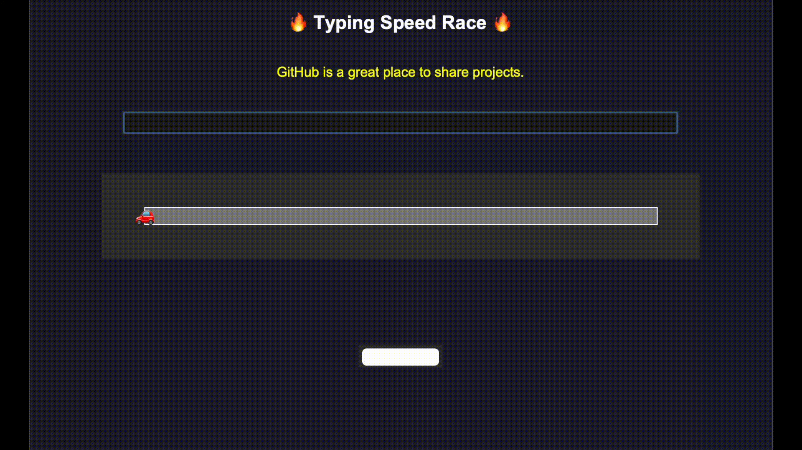

# Typing Speed Race 🏁

A fun and interactive Python game built with **Tkinter**.  
Type the given words as fast as you can to move your car forward and beat the race clock!  

## 🚗 Features
- Type words correctly to move your car forward  
- Timer with Words Per Minute (WPM) calculation  
- Accuracy tracking (%)  
- Restart button to play again instantly  
- Simple and lightweight — no extra libraries needed   

## 📂 Project Structure

    🎮 Features
    🔥 Random sentences to type
    ⏱️ Timer & WPM (words per minute) calculation
    🎯 Accuracy percentage
    🏎️ Car race progress bar (car moves as you type correctly)
    🔁 Restart button for replay
    Simple GUI built with Tkinter

    📸 Demo GIF
    

🚀 Installation & Run
    1. Clone the repo:

git clone https://github.com/your-username/typing-speed-race.git
cd typing-speed-race

Run the game:
python typing_speed_race.py

    💡 Future Ideas
Add countdown before race start
AI opponent car with random WPM
Sound effects for win/lose
Leaderboard to track best scores
